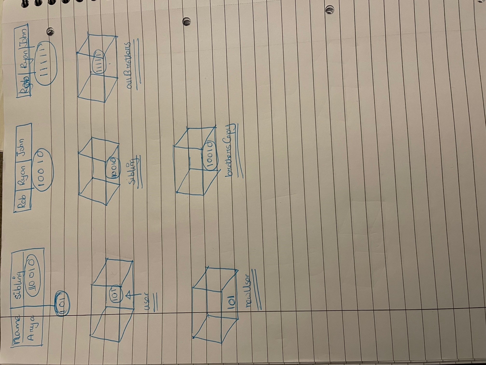

```js
let user = {
  name: 'Arya',
  sibling: ['Robb', 'Ryan', 'John'],
};
let allBrothers = ['Robb', 'Ryan', 'John'];
let brothersCopy = user.sibling;
let usename = user.name;
let newUser = user;
```

1. Memory representation

- Create the memory representation of the above snippet on notebook.
- Take a photo/screenshot and add it to the folder `code`

<!-- To add this image here use  -->

2. Answer the following with reason:

- `user == newUser;` // output and reason true non-primitive same address
- `user === newUser;` // output and reason true non-primitive same address && same type
- `user.name === newUser.name;` // output and reason true non-primitive same address && same type
- `user.name == newUser.name;`  // output and reason true primitive 'Arya'
- `user.sibling == newUser.sibling;`  // output and reason true non-primitive same address 
- `user.sibling === newUser.sibling;` // output and reason true non-primitive same address && type
- `user.sibling == allBrothers;` // output: false reason: different address
- `user.sibling === allBrothers;` // output: false reason: different address
- `brothersCopy === allBrothers;` // output: false reason: different address
- `brothersCopy == allBrothers;` // output: false reason: different address
- `brothersCopy == user.sibling;` // output: true reason: same address
- `brothersCopy === user.sibling;` // output: true reason: same address && same type
- `brothersCopy[0] === user.sibling[0];` // output: true reason: same value 'Rob' same type
- `brothersCopy[1] === user.sibling[1];` // output: true reason: same value 'Ryan' same type
- `user.sibling[1] === newUser.sibling[1];` //output: true reason same value same type 'Ryan'
